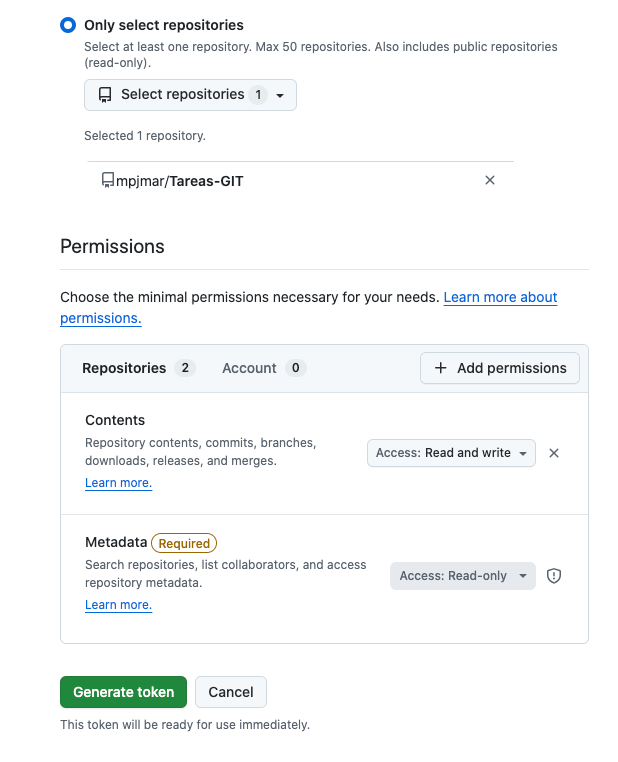

# TAREA1 1: Comienzo con GIT por línea de comandos

# Generación de credenciales en GitHub para sincronizar repositorios

## Parte 1 — Generar el token en GitHub

### Pasos:
1. Abrir GitHub e iniciar sesión.  
2. Ir a **Settings → Developer settings → Personal access tokens** 
3. Elegir **Generate new token** 
  Podemos seleccionar entre:
  - «classic»: acceso a todos los repos (menos seguro)
  - «fine-grained»: acceso sólo a determinados repos (más seguro)
Seleccionamos <<fine-grained>> y le otorgamos los permisos:
  - Contents: Read and write
  - Metadata: Read-only
  
5. **Nombre** del token: `Entornos de desarrollo`.
6. **Caducidad**: 30 de junio de 2026
7. Generamos y **copiamos el token** en un lugar seguro.
|[token](capturas/img-1.png)

## Parte 2 — Usar credenciales por línea de comandos en Windows (git-bash)

### Problema
En Windows, Git utiliza por defecto un gestor de credenciales del sistema, el **Git Credential Manager (GCM)** o 
el **«Windows Credential Manager»**, que abre una ventana gráfica al hacer git push o git pull, solicitando usuario
y contraseña o token. Vamos a usar directamente el token **sólo este repositorio** por medio de autenticación 
local, y que otros repos sigan usando el helper de Windows.

Para ello debemos:
1. **Deshabilitar el helper global sólo para este repositorio** (sin afectar a otros).
2. **Cachear** las credenciales localmente para que git sólo pida el token una vez.

### 1. Deshabilitar el uso de Windows Credential Manager para nuestro repositorio
Git tiene dos niveles de configuración:
1. **git config --global** Para todos los repos del usuario
2. **git config --local** Sólo el repo donde nos encontramos

### Pasos

```bash
# 1. Navega al repositorio
cd ruta/del/repositorio

# 2. Deshabilita el helper global solo para este repo
git config --local credential.helper ""

# 3. Cachea las credenciales para que solo se pidan una vez
git config --local credential.helper store

# 4. Agrega cambios
git add .

# 5. Hace commit
git commit -m "Deshabilitando Windows Credential Manager"

# 6. Sube al repo remoto
git push origin main

